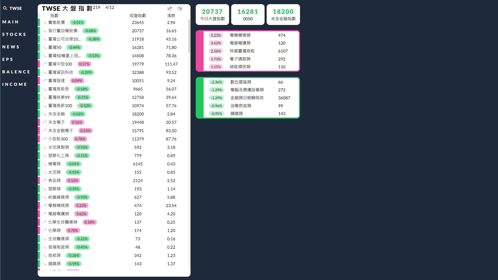
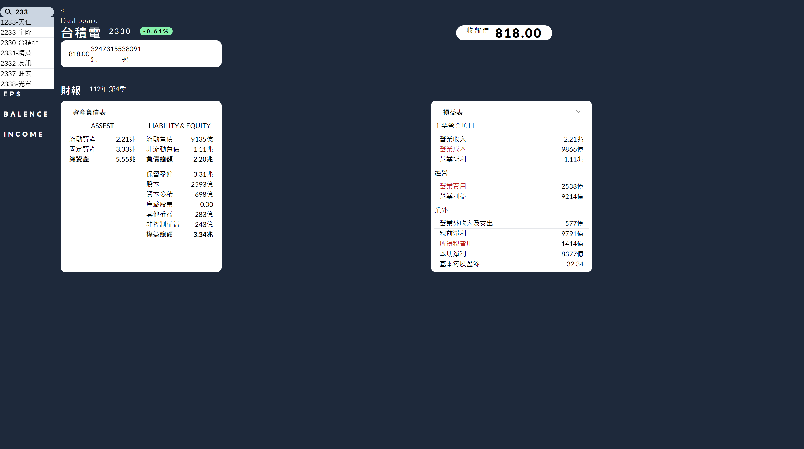
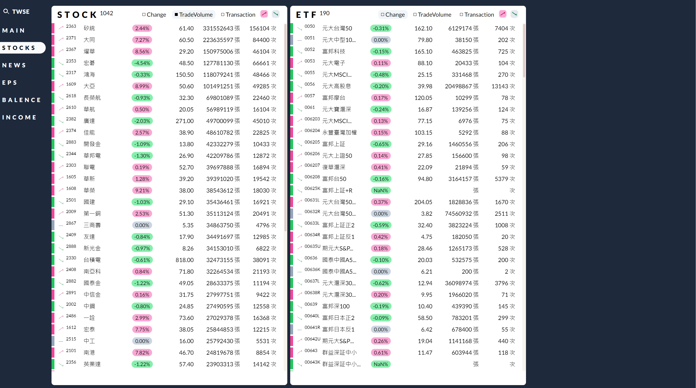
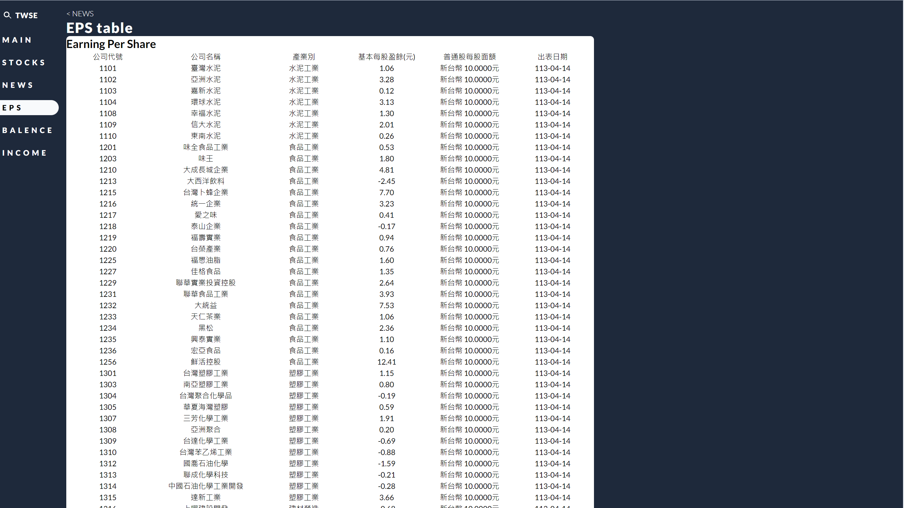
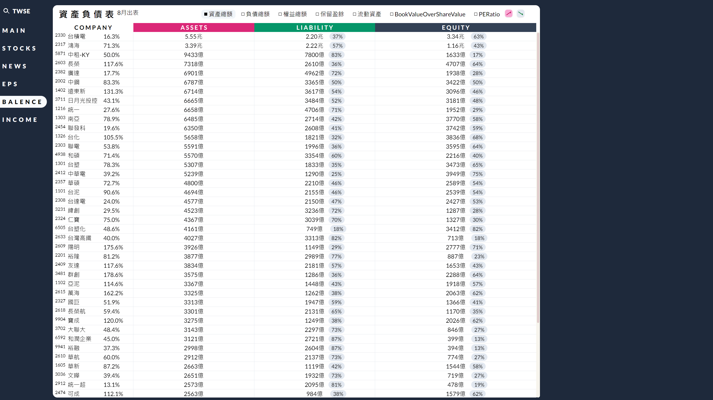
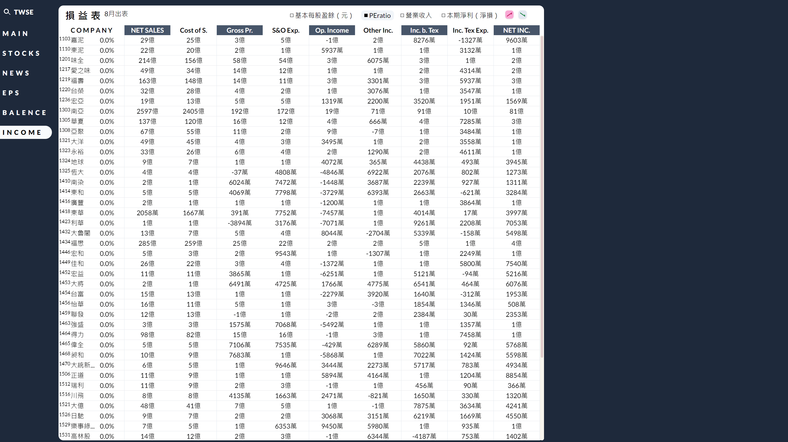

# 個人台股彙整後台

### 內容：
爬twse的api，彙整每日的盤後資訊，製作財報和及時計算各類財報指標及排序，用來做價值投資的標的選擇。

### 系統概述：
- 前端：Typescript、ReactJs、Redux、Highcharts

- 後端：Python

- 資料庫：MySql

- 網路架構：Restful API

### 畫面摘要
- 首頁

- 個股

- 當天所有指數

- EPS

- 資產負債表

- 損益表

- 證交所新聞

